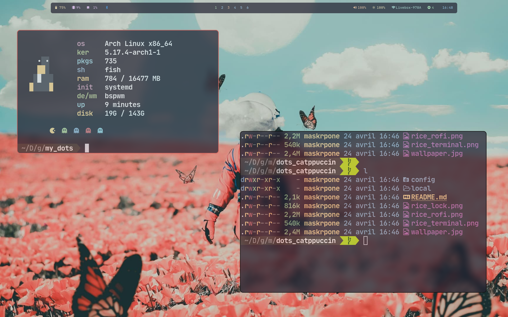

# Catppuccin with more light - not maintained

You'll find all the configuration on the config directory.

_My workflow stayed the same as the first desktop, if you are curious of what I use, go look [here](https://github.com/Maskrpone/dots_catppuccin)_

The compositor used is the ibhagwan's picom fork

